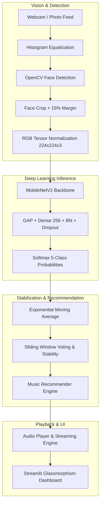

# 🎵 EmotiBeat: Real-Time Emotion-Controlled Music Player

[](https://www.python.org/)
[](https://tensorflow.org/)
[](https://opencv.org/)
[](https://streamlit.io/)

A modular, production-ready **Real-Time Emotion-Controlled Music Player** combining **Computer Vision (OpenCV)**, **Deep Transfer Learning (MobileNetV2)**, **Temporal Emotion Smoothing**, an **Extensible Music Recommendation Engine**, and a **Streamlit Dark Glassmorphism Dashboard**.

---

## 🌟 Key Features

1. **Facial Emotion Recognition (5 Classes)**:
   - Recognizes **Happy**, **Sad**, **Angry**, **Surprise**, and **Neutral** facial states.
   - Built on a lightweight **MobileNetV2** transfer learning backbone pre-trained on ImageNet with custom classification heads, batch normalization, dropout, and regularizers.

2. **OpenCV Vision & Face Detection**:
   - Automatic face detection with histogram equalization for contrast/lighting invariance.
   - Intelligent bounding box padding/margin expansion (+15%) to capture full facial expression context (jawline, eyebrows, forehead).

3. **Temporal Emotion Smoothing**:
   - **Exponential Moving Average (EMA)** of class probability distributions.
   - **Sliding Window Consensus Buffer** ($N=10$) with real-time stability scoring.
   - **Hysteresis Thresholding** preventing rapid track-switching jitter and facial micro-expression flickers.

4. **Extensible Audio & Music Engine**:
   - Pluggable `BaseMusicProvider` interface designed for easy integration with **Spotify API** (`spotipy`) and **YouTube Streamer**.
   - Out-of-the-box **Local Music Provider** and **Procedural Harmonic Synthesizer** that procedurally generates royalty-free audio tracks for all 5 emotions, ensuring immediate standalone execution with zero external downloads required.

5. **Production Streamlit Dashboard**:
   - Modern dark glassmorphism theme.
   - Dual-column real-time interface with live webcam snapshots, bounding box overlays, and confidence meters.
   - Interactive audio player with Play/Pause, Next Track, Smart Shuffle, Manual Emotion Overrides, and Session Analytics.
   - Fully optimized with `st.cache_resource` and `st.session_state`.

---

## 📐 System Architecture



---

## 📁 Repository Structure

```
├── app.py                      # Main Streamlit Web Dashboard
├── requirements.txt            # Pinned project dependencies
├── README.md                   # Documentation & Setup Guide
├── src/
│   ├── __init__.py
│   ├── config.py               # Centralized configuration, hyperparams, and emotion metadata
│   ├── face_detector.py        # OpenCV face detector, bbox margin expansion & normalizer
│   ├── model.py                # MobileNetV2 architecture & inference engine
│   ├── train.py                # FER-2013 2-stage training pipeline, class weights & metrics
│   ├── smoothing.py            # Temporal EMA & sliding window voting smoother
│   ├── utils.py                # Image conversions, confusion matrix plotting, JSON helpers
│   └── music_engine/
│       ├── __init__.py
│       ├── base.py             # Abstract BaseMusicProvider interface (Spotify/YouTube extensible)
│       ├── local_provider.py   # Local filesystem music provider & tag indexer
│       ├── synthesizer.py      # Procedural WAV harmonic music synthesizer
│       └── recommender.py      # Emotion-to-music recommendation & queue manager
├── tests/
│   ├── __init__.py
│   └── test_components.py      # Pytest unit tests for all core modules
├── music_library/              # Local music directories categorized by emotion
│   ├── happy/
│   ├── sad/
│   ├── angry/
│   ├── surprise/
│   └── neutral/
├── models/                     # Saved model checkpoints & emotion label mappings
└── assets/                     # UI badges, confusion matrix plots, and reports
```

---

## 🚀 Quickstart Guide

### 1. Clone & Setup Environment

```bash
# Clone the repository
git clone <repo-url>
cd "Enotion based music player"

# Create and activate virtual environment
python -m venv venv
# On Windows:
.\venv\Scripts\activate
# On Linux/macOS:
source venv/bin/activate

# Install dependencies
pip install -r requirements.txt
```

### 2. Launch the Streamlit App

```bash
streamlit run app.py
```

The browser will open at `http://localhost:8501`. If your `music_library/` is empty on first startup, EmotiBeat will automatically generate high-quality starter tracks for each emotion.

---

## 🧠 Model Training on FER-2013

The training pipeline in `src/train.py` features a strict, non-leaking train/val/test split, real-time data augmentation, class imbalance weighting, and two-stage transfer learning:

### 1. Download Dataset
Place `fer2013.csv` into the `data/` folder, or organize images into `data/train/`, `data/val/`, `data/test/`.

### 2. Run Training Pipeline
```bash
python -m src.train --data data/fer2013.csv --epochs 30 --fine_tune_epochs 10 --batch_size 32
```

### 3. Pipeline Highlights
- **Stage 1 (Frozen Backbone)**: Trains the custom classification head with Adam ($\text{lr}=10^{-4}$) and categorical crossentropy with label smoothing.
- **Stage 2 (Fine-Tuning)**: Unfreezes MobileNetV2 from layer 100 onwards with fine-tuning learning rate ($\text{lr}=10^{-5}$).
- **Imbalance Handling**: Automatically calculates `compute_class_weight(class_weight='balanced')`.
- **Callbacks**: `ModelCheckpoint` (best val accuracy), `EarlyStopping` (patience=8), `ReduceLROnPlateau`, and `CSVLogger`.
- **Artifacts**: Automatically exports `assets/confusion_matrix.png`, `assets/classification_report.json`, and `assets/classification_report.txt`.

---

## 🔌 Extensibility: Adding Spotify / YouTube

The music engine uses an abstract interface `BaseMusicProvider` defined in `src/music_engine/base.py`:

```python
class BaseMusicProvider(ABC):
    @abstractmethod
    def initialize(self) -> bool: pass
    
    @abstractmethod
    def get_tracks_by_emotion(self, emotion: str) -> List[Track]: pass
    
    @abstractmethod
    def get_track_audio_bytes(self, track: Track) -> Optional[bytes]: pass
```

To add **Spotify**:
1. Implement `SpotifyMusicProvider(BaseMusicProvider)` using `spotipy`.
2. Map Spotify Valence and Energy audio features:
   - **Happy**: High Valence ($>0.7$), High Energy ($>0.6$)
   - **Sad**: Low Valence ($<0.3$), Low Energy ($<0.4$)
   - **Angry**: Low Valence ($<0.4$), High Energy ($>0.8$)
   - **Surprise**: High Valence ($>0.6$), High Energy ($>0.7$)
   - **Neutral**: Moderate Valence ($0.4 - 0.6$), Low/Moderate Energy ($0.3 - 0.5$)
3. Pass `SpotifyMusicProvider` to `MusicRecommender(provider)`.

---

## 🧪 Running Unit Tests

Run the complete test suite with `pytest`:

```bash
python -m pytest tests/ -v
```

Tests cover:
- OpenCV face detection and bounding box margin expansion
- MobileNetV2 tensor output shapes and emotion probabilities
- Temporal EMA smoother updates and stability indices
- Procedural audio synthesizer waveforms and WAV exports
- Music provider indexing and recommender queues

---

## 📄 License
MIT License. Built for real-time computer vision and music playback workflows.
